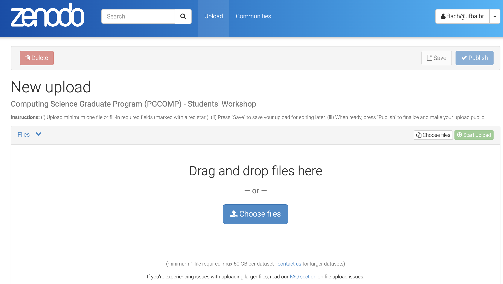
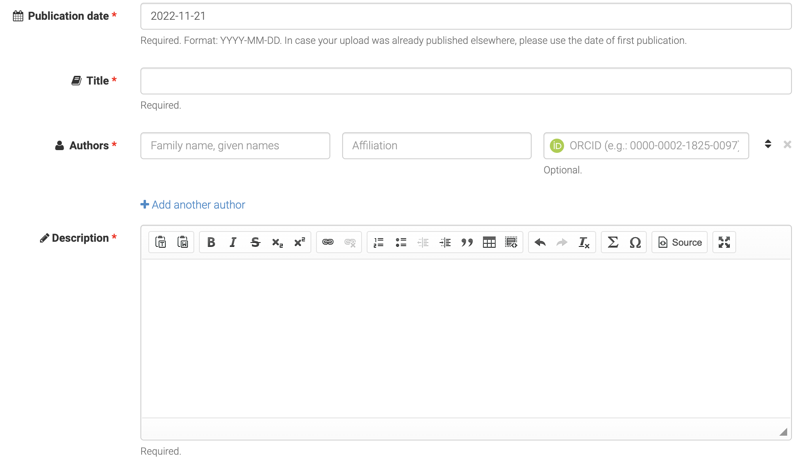

 
### Informações 

- A Programação Preliminar do WEPGCOMP 2023 é apresentada na [página do evento](/2023).
- O evento está organizado em **sessões temáticas** 
para apresentação de trabalhos das/os doutorandas/os matriculadas/os no componente curricular MATA33.
- A apresentação no WEPGCOMP é _opcional_ para as/os doutorandas/os que realizaram ou realizarão o exame de qualificação (MATA34) em 2023. Nesse caso, a nota do componente MATA33 será a mesma atribuída ao componente MATA34 em 2023.
- Cada trabalho apresentado em uma sessão contará com um grupo de, no mínimo, três docentes responsáveis pela avaliação do trabalho, incluindo seu orientador.
- O evento será realizado na modalidade **presencial**.
Todas as apresentações serão transmitidas no canal do evento no YouTube (<https://www.youtube.com/@ComputacaoUFBA>).

### Preparação da apresentação

#### Template para slides

O template para slides do WEPGCOMP está disponível 
[aqui](https://docs.google.com/presentation/d/1-xGEu3hvVRVtdjE9yt9DTNlooDm4DqFimnPJMXETWQ8/edit?usp=sharing).
Faça uma cópia, renomeie para `wepgcomp23-seunome-sobrenome`, e adicione os seus slides. 
Os dois primeiros slides do template (“Título do trabalho” e “Ficha do trabalho”)  
e o slide sobre “Estágio atual da pesquisa” são _obrigatórios_.
 
#### Depósito de slides no Zenodo

Independente da modalidade de participação (presencial ou remota), 
os autores devem depositar no Zenodo, até **20/11/2023, 23:59h (BRT)**, 
um arquivo (formato PDF) com a versão final dos slides da apresentação.
O nome do arquivo deve ser `wepgcomp23-seunome-sobrenome.pdf`.

[Link para upload na comunidade do WEPGCOMP no Zenodo](https://zenodo.org/deposit/new?c=wepgcomp-ic-ufba).

### Apresentação de trabalhos

- Os organizadores do WEPGCOMP 2023 farão a coleta dos slides depositados no Zenodo no dia 21/11 e os disponibilizarão para os coordenadores de sessão.

-  Cada apresentação não deve ultrapassar os 10 minutos de duração. Na sequência da apresentação, os avaliadores terão 5 minutos para perguntas e sugestões. Perguntas adicionais via chat do YouTube serão encaminhadas para o apresentador.

- Recomendamos que os apresentadores sigam boas práticas e respeitem o tempo de apresentação (algumas sugestões a seguir).

#### Boas Práticas para o(a) Apresentador(a)

- O WEPGCOMP 2023 será presencial.

- Entrar em contato com o/a coordenadora da sua sessão ao menos **15 minutos antes do início da sessão**. 

- O controle de tempo da apresentação será rigoroso: **10 minutos para apresentação oral** e **5 minutos para perguntas**. 
    - Dica: prepare um roteiro para sua apresentação e treine algumas vezes.

### Recomendações para os Avaliadores

O objetivo principal do WEPGCOMP é tornar públicas as pesquisas de doutorado e o andamento de suas atividades. Não é necessário ser pesquisador nos temas das apresentações para avaliar o andamento do trabalho de doutorado.

Para as apresentações realizadas na(s) sessão(ões) em que participa como avaliador:

- Observar a data de ingresso do discente no PGCOMP e se é bolsista.
- Fazer perguntas objetivas e comentários construtivos, considerando o estágio do trabalho: pré-qualificação, qualificação recente (no ano do evento) e pós-qualificação.
   + Espera-se que o doutorando em estágio de pré-qualificação tenha concluído as disciplinas e  mostre que o tema da pesquisa está definido, com revisão da literatura em andamento (no mínimo).
- Se possível, olhar a apresentação do WEPGCOMP do ano anterior para avaliar o progresso do trabalho de pesquisa do discente.

### Recomendações para a Audiência

- Recomenda-se chegar à sala antes do início de cada sessão.

- Após as perguntas dos avaliadores, se houver tempo, o coordenador da sessão fará a moderação das perguntas da audiência.
Se preferir, coloque suas perguntas no chat do YouTube. 

---

## Depósito no Zenodo

1. Acesse a URL para upload do arquivo com slides em formato PDF:
https://zenodo.org/deposit/new?c=wepgcomp-ic-ufba

<!--  -->

2. Após a escolha do arquivo ("choose files"), clique em "Start upload".

3. Marque o tipo do upload ("Presentation").

4. Informe data da submissão, título da apresentação, seu nome e resumo enviado ao PGCOMP (informações em inglês poderão dar maior visibilidade ao trabalho).

<!--  -->

